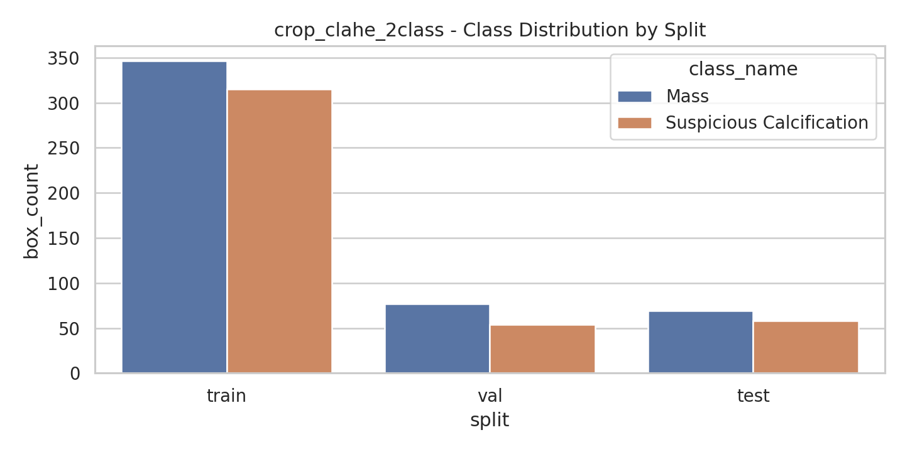
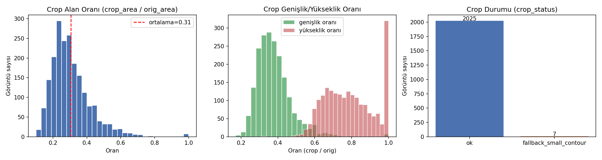
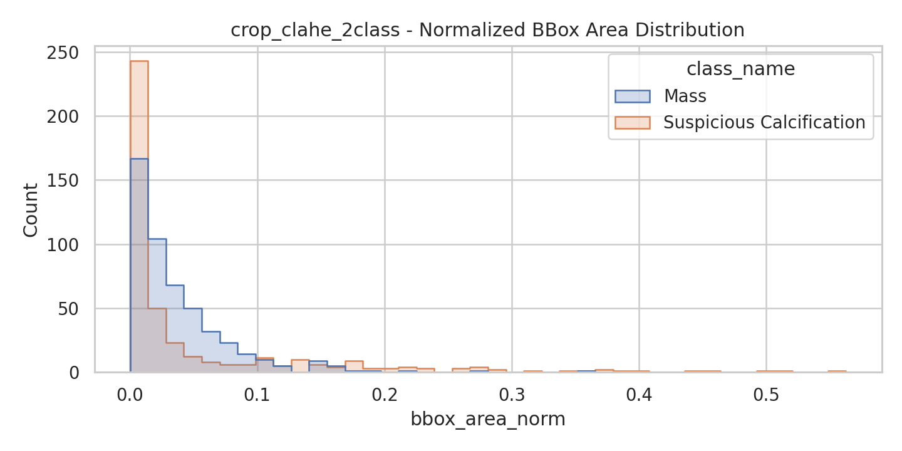
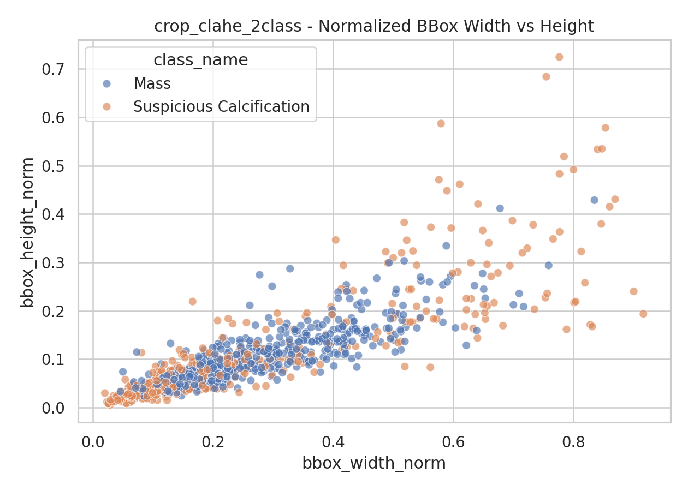
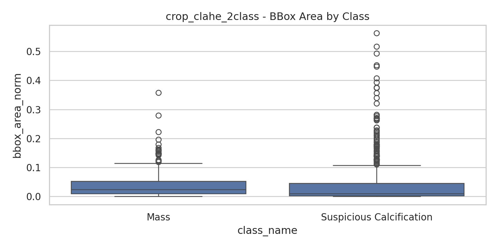

# VinDr-Mammo İki Sınıflı Lezyon Tespiti

**YOLOv8s ve Faster R-CNN ile Mass / Suspicious Calcification tespiti, ham görüntü ve Crop+CLAHE ablasyonu**

Bu proje, VinDr-Mammo veri setinden çalışma için oluşturulan kontrollü bir alt küme üzerinde iki mamografi bulgusunun nesne tespiti yaklaşımıyla lokalize edilmesini inceler:

- **Mass**
- **Suspicious Calcification**

Çalışmanın temel amacı yalnızca bir model eğitmek değil; veri seçimi, DICOM ön işleme, çalışma düzeyinde veri bölme, model karşılaştırması ve ön işleme ablasyonunu tekrarlanabilir bir deney protokolü içinde değerlendirmektir.

> **Kapsam notu:** Bu çalışma araştırma ve eğitim amaçlıdır. Klinik karar desteği veya tanı amacıyla kullanılmamalıdır.

> **Veri erişimi notu:** Bu repo kod, dokümantasyon ve sonuç/figür dosyalarını içerir. VinDr-Mammo'nun DICOM görüntüleri ve bunlardan üretilen PNG/etiket dosyaları PhysioNet Data Use Agreement (DUA) kapsamında olduğu için `.gitignore` ile repo dışında tutulmuştur. Eğitilmiş model ağırlıkları (`.pt`) ve referans makale PDF'leri de aynı nedenle (boyut/telif) repoya dahil edilmemiştir.

---

## İçindekiler

- [Projenin Amacı](#projenin-amacı)
- [Veri Seti ve Alt Küme Seçimi](#veri-seti-ve-alt-küme-seçimi)
- [Train / Validation / Test Bölünmesi](#train--validation--test-bölünmesi)
- [İşleme Adımları](#işleme-adımları)
- [Karşılaştırılan Yöntemler](#karşılaştırılan-yöntemler)
- [Eğitim Protokolü](#eğitim-protokolü)
- [Değerlendirme Metrikleri](#değerlendirme-metrikleri)
- [Sonuçlar](#sonuçlar)
- [Nitel Sonuçlar](#nitel-sonuçlar)
- [Repo Yapısı](#repo-yapısı)
- [Çalıştırma](#çalıştırma)
- [Üretilen Çıktılar](#üretilen-çıktılar)
- [Sınırlılıklar](#sınırlılıklar)
- [Referanslar](#referanslar)
- [Veri Erişimi ve Atıf](#veri-erişimi-ve-atıf)

---

## Projenin Amacı

Mamografi görüntülerindeki bulguların yalnızca görüntü düzeyinde sınıflandırılması, lezyonun nerede bulunduğunu göstermez. Bu nedenle proje bir **object detection** problemi olarak ele alınmış; modelden hem bulgu sınıfını hem de lezyonu çevreleyen bounding box'ı tahmin etmesi beklenmiştir.

Çalışma iki araştırma sorusuna odaklanır:

1. **Tek aşamalı YOLOv8s ile iki aşamalı Faster R-CNN arasında bu alt kümede nasıl bir performans farkı vardır?**
2. **Göğüs bölgesini kırpma ve CLAHE ile yerel kontrastı artırma, Faster R-CNN performansını değiştirir mi?**

İki sınıflı kapsam, sınırlı hesaplama kaynağı altında kontrollü bir model karşılaştırması ve sınıf bazlı hata analizi yapabilmek amacıyla seçilmiştir. Bu seçim, diğer mamografi bulgularının önemsiz olduğu anlamına gelmez.

Bu iki araştırma sorusu, mamografi görüntülerinde nesne tespiti tabanlı CAD sistemleri üzerine yapılan çalışmalarla aynı genel çerçevededir: Ribli ve ark. [4] Faster R-CNN tabanlı bir sistemle mamografi lezyonlarını tespit ve sınıflandırmış, Karaca Aydemir ve ark. [3] YOLO ailesi modelleriyle meme kitlelerini tespit etmiş, Abdikenov ve ark. [2] ise transfer learning ile görüntü ön işlemenin (crop+CLAHE) INbreast, CBIS-DDSM ve VinDr-Mammo veri setlerindeki etkisini incelemiştir. Bu proje, benzer bir karşılaştırma protokolünü VinDr-Mammo'nun kontrollü bir alt kümesi üzerinde uygulamaktadır (bkz. [Referanslar](#referanslar)).

---

## Veri Seti ve Alt Küme Seçimi

Kaynak veri seti: **VinDr-Mammo v1.0.0** [1].

### Hedef sınıfların seçim gerekçesi

VinDr-Mammo'nun tam annotasyon dosyalarında (`finding_annotations.csv`, 20.486 bulgu satırı; bir görüntüde birden fazla bulgu olabileceğinden kategori toplamı satır sayısını aşabilir) bulgu kategorilerine göre dağılım aşağıdaki gibidir:

| Bulgu kategorisi | Adet |
|---|---:|
| No Finding | 18.232 |
| Mass | 1.226 |
| Suspicious Calcification | 543 |
| Focal Asymmetry | 269 |
| Architectural Distortion | 119 |
| Asymmetry | 97 |
| Suspicious Lymph Node | 57 |
| Skin Thickening | 57 |
| Nipple Retraction | 37 |
| Global Asymmetry | 26 |
| Skin Retraction | 18 |

<p align="center">
  
</p>

**Mass** ve **Suspicious Calcification**, "No Finding" dışında en sık görülen iki patolojik bulgu kategorisidir ve literatürde mamografi lezyon tespiti çalışmalarının (Ribli ve ark. [4], Karaca Aydemir ve ark. [3], Abdikenov ve ark. [2]) odaklandığı sınıflarla örtüşmektedir. Bu nedenle bu iki sınıf, hem yeterli eğitim örneği sunması hem de literatürle karşılaştırılabilirlik sağlaması bakımından bu projenin hedefi olarak seçilmiştir.

Alt küme oluşturulurken yalnızca pozitif görüntüler alınmamış; gerçekçi bir tespit senaryosu oluşturmak için negatif görüntüler de korunmuştur.

### Seçilen çalışma türleri

| Çalışma türü | Sayı | Açıklama |
|---|---:|---|
| Target-positive study | 340 | En az bir Mass ve/veya Suspicious Calcification anotasyonu içerir |
| Hard-negative study | 85 | Hedef iki sınıfı içermez; ancak başka mamografi bulguları içerir |
| Normal-negative study | 85 | Hedef lezyon anotasyonu bulunmayan normal negatif çalışma |
| **Toplam** | **510** | Study-level olarak seçilen toplam çalışma |

Target-positive çalışmalar, iki sınıfın temsili korunacak biçimde aşağıdaki gruplara ayrılarak seçilmiştir:

- yalnızca Mass,
- yalnızca Suspicious Calcification,
- her iki hedef sınıfı içeren çalışmalar.

Rastgele seçim ve bölme işlemlerinde **seed = 42** kullanılmıştır.

### Anotasyon politikası

VinDr-Mammo bulgu tablosunda aynı bounding box birden fazla bulgu etiketi taşıyabilmektedir. Çalışmada tek etiketli iki sınıflı nesne tespiti formatı kullanıldığı için aynı kutuda hem **Mass** hem de **Suspicious Calcification** bulunması durumunda birincil etiket **Mass** olarak atanmıştır.

Hazırlık öncesindeki hedef anotasyon özeti:

| Açıklama | Sayı |
|---|---:|
| Exploded target labels | 1,013 |
| Unique primary bounding boxes | 927 |
| Mass primary boxes | 494 |
| Suspicious Calcification primary boxes | 433 |
| İki hedef etiketi aynı kutuda taşıyan bbox | 86 |

Görüntü dönüşümü ve bounding box doğrulaması sonrasında deneylerde kullanılan ham veri varyantında **925**, Crop+CLAHE varyantında ise **919** geçerli kutu kalmıştır. Crop işlemi sonrasında görüntü sınırları dışında veya geçersiz hale gelen kutular otomatik olarak çıkarılmıştır.

### Seçim manifesti ve nihai veri

Alt küme seçim manifestinde 2,040 DICOM görüntüsü bulunmaktadır. Eğitim ve değerlendirmede kullanılan son hazırlanmış veri seti ise başarıyla hazırlanmış **2,032 PNG görüntüsünden** oluşmaktadır. Aşağıdaki tüm split ve sonuç tabloları bu nihai veri setine aittir.

---

## Train / Validation / Test Bölünmesi

Veri bölme işlemi görüntü düzeyinde değil, **study-level** gerçekleştirilmiştir. Böylece aynı hastaya/çalışmaya ait farklı mamografi görünümlerinin train ve test gibi farklı splitlere dağılması engellenmiştir.

Bölme oranı:

- **Train:** %70
- **Validation:** %15
- **Test:** %15

Stratification sırasında çalışma türü ve hedef sınıf varlığı birlikte dikkate alınmıştır:

- target_mass_only,
- target_calc_only,
- target_both,
- hard_negative,
- normal_negative.

### Study-level dağılım

| Split | Study sayısı |
|---|---:|
| Train | 356 |
| Validation | 77 |
| Test | 77 |
| **Toplam** | **510** |

### Nihai görüntü ve kutu dağılımı: Raw PNG

| Split | Görüntü | Pozitif görüntü | Negatif görüntü | Toplam bbox | Mass | Suspicious Calcification |
|---|---:|---:|---:|---:|---:|---:|
| Train | 1,418 | 486 | 932 | 664 | 346 | 318 |
| Validation | 306 | 103 | 203 | 131 | 77 | 54 |
| Test | 308 | 95 | 213 | 130 | 69 | 61 |
| **Toplam** | **2,032** | **684** | **1,348** | **925** | **492** | **433** |

### Nihai görüntü ve kutu dağılımı: Crop+CLAHE

| Split | Görüntü | Pozitif görüntü | Negatif görüntü | Toplam bbox | Mass | Suspicious Calcification |
|---|---:|---:|---:|---:|---:|---:|
| Train | 1,418 | 484 | 934 | 661 | 346 | 315 |
| Validation | 306 | 103 | 203 | 131 | 77 | 54 |
| Test | 308 | 93 | 215 | 127 | 69 | 58 |
| **Toplam** | **2,032** | **680** | **1,352** | **919** | **492** | **427** |

<p align="center">
  
</p>

---

## İşleme Adımları

Projenin uçtan uca işlem akışı aşağıdaki gibidir:

```text
VinDr-Mammo metadata ve annotation dosyaları
                    │
                    ▼
Mass / Suspicious Calcification hedeflerinin seçimi
                    │
                    ▼
Target-positive + hard-negative + normal-negative study seçimi
                    │
                    ▼
Study-level stratified train / validation / test split
                    │
                    ▼
DICOM indirme ve dosya doğrulama
                    │
                    ▼
DICOM → 8-bit PNG dönüşümü + bbox dönüşümü
                    │
          ┌─────────┴─────────┐
          ▼                   ▼
      Raw PNG           Breast Crop + CLAHE
          │                   │
          └─────────┬─────────┘
                    ▼
YOLO ve COCO anotasyonlarının oluşturulması
                    │
                    ▼
EDA + görsel bbox kontrolü
                    │
                    ▼
YOLOv8s / Faster R-CNN eğitimi
                    │
                    ▼
Validation ile model seçimi → bağımsız test değerlendirmesi
```

### 1. DICOM indirme ve doğrulama

- İndirme listesi alt küme manifestinden oluşturuldu (`dataset/subsets/target2class_subset_v2_medium_balanced/selected_dicom_urls.txt`).
- DICOM dosyaları önce Colab yerel diskine indirildi, ardından Google Drive'a senkronize edildi.
- Dosya boyutu ve `pydicom` ile okunabilirlik kontrolü yapıldı.
- Seçilen 2,040 DICOM dosyasının tamamı indirme sonunda erişilebilir durumdaydı (bkz. `dataset/subsets/target2class_subset_v2_medium_balanced/subset_audit/reports/target2class_subset_v2_medium_balanced_FINAL_DOWNLOAD_REPORT.md`).

### 2. DICOM → PNG dönüşümü

Her DICOM görüntüsüne aşağıdaki işlemler uygulandı:

1. Pixel array `pydicom` ile okundu.
2. Mümkün olduğunda VOI LUT uygulandı.
3. `MONOCHROME1` görüntüler ters çevrildi.
4. Yoğunluk değerleri **%0.5–%99.5 percentile clipping** ile sınırlandı.
5. Görüntü 8-bit `[0, 255]` aralığına normalize edildi.
6. En uzun kenar en fazla **2,048 piksel** olacak şekilde en-boy oranı korunarak yeniden boyutlandırıldı.
7. Bounding box koordinatları aynı ölçek oranıyla güncellendi ve görüntü sınırlarına kırpıldı.

2,040 görüntüden **8'inin** (6 train, 2 val) DICOM piksel verisi bozuk olduğu için ("number of bytes of pixel data is less than expected") PNG'ye dönüştürülememiş ve veri setinden çıkarılmıştır — nihai 2,032 görüntü buradan gelmektedir (bkz. `dataset/prepared_datasets/target2class_subset_v2_medium_balanced/logs/raw_png_failed_conversions.csv`).

Detaylı rapor: `dataset/subsets/target2class_subset_v2_medium_balanced/prepared_dataset_reports/target2class_subset_v2_medium_balanced_PNG_PREPARATION_AND_EDA_REPORT.md`

### 3. Raw PNG veri varyantı

Ham varyantta DICOM'dan dönüştürülen görüntüler, yeniden boyutlandırma dışında ek kontrast veya bölge kırpma işlemi uygulanmadan kullanıldı.

### 4. Breast Crop + CLAHE veri varyantı

Crop+CLAHE varyantında aşağıdaki işlem sırası kullanıldı:

1. Gri seviye görüntüye Gaussian blur uygulandı.
2. Otsu threshold ile meme dokusu için ikili maske üretildi.
3. Morphological closing ve opening ile maske temizlendi.
4. En büyük contour meme bölgesi olarak kabul edildi.
5. Bounding rectangle çevresine görüntü boyutunun **%3.5'i** kadar margin eklendi.
6. Güvenilir contour bulunamadığında görüntünün tamamı kullanıldı (2,032 görüntüden 7'sinde bu "fallback" uygulanmıştır).
7. Crop bölgesine **CLAHE** uygulandı:
   - `clipLimit = 2.0`
   - `tileGridSize = (8, 8)`
8. Bounding box koordinatları yeni crop koordinat sistemine taşındı, sınırda kalan kutular kırpıldı ve geçersiz kutular çıkarıldı.

Kırpılan görüntülerin meme bölgesi alanının orijinal görüntüye oranı ortalama **0,306** (medyan **0,285**)'tir. Detaylı rapor: `dataset/subsets/target2class_subset_v2_medium_balanced/prepared_dataset_reports/target2class_subset_v2_medium_balanced_CROP_CLAHE_PREPROCESSING_REPORT.md`

<p align="center">
  
</p>

<p align="center">
  
</p>

### 5. Anotasyon formatları

Her iki veri varyantı için iki ayrı anotasyon biçimi üretildi:

- **YOLO formatı:** `labels/{train,val,test}/*.txt` + `data.yaml` (`nc: 2`, `names: {0: Mass, 1: Suspicious Calcification}`)
- **COCO formatı:** `annotations/instances_{train,val,test}.json` (kategori id'leri `1: Mass`, `2: Suspicious Calcification`)

Negatif görüntüler veri setinde tutuldu ve bunlar için boş label dosyaları oluşturuldu.

### 6. EDA ve görsel doğrulama

Hazırlanan veri setinde şu kontroller yapıldı:

- split başına görüntü, pozitif ve negatif örnek sayısı,
- sınıf başına bbox sayısı,
- bbox genişliği, yüksekliği ve normalize alan dağılımı,
- crop öncesi ve sonrası kutu koordinatlarının tutarlılığı,
- rastgele örneklerde ground-truth kutularının görsel kontrolü.

<p align="center">
  
</p>

<p align="center">
  
</p>

<p align="center">
  
</p>

Son grafikte görülebileceği gibi, Suspicious Calcification kutuları Mass kutularına kıyasla sistematik olarak daha küçük bir alana sahiptir; bu durum [Sınırlılıklar](#sınırlılıklar) bölümünde ele alınan düşük calcification tespit performansıyla tutarlıdır.

---

## Karşılaştırılan Yöntemler

Bu repoda tamamlanmış üç deney koşusu karşılaştırılmaktadır.

| Deney | Model | Veri varyantı | Amaç |
|---|---|---|---|
| E1 | YOLOv8s | Raw PNG | Tek aşamalı dedektör baseline'ı |
| E2 | Faster R-CNN ResNet50-FPN | Raw PNG | İki aşamalı dedektör baseline'ı |
| E3 | Faster R-CNN ResNet50-FPN | Crop+CLAHE | Ön işleme ablasyonu |

### YOLOv8s

YOLOv8s tek aşamalı bir nesne dedektörü olarak kullanılmıştır. Model doğrudan sınıf ve bounding box tahmini üretir. Bu koşu, hız ve basitlik açısından güçlü bir baseline oluşturmak amacıyla ham PNG görüntüler üzerinde eğitilmiştir. Bu yaklaşım, mamografi görüntülerinde YOLO ailesi modellerini kullanan Karaca Aydemir ve ark. [3] ile genel çerçevede örtüşmektedir.

### Faster R-CNN ResNet50-FPN

Faster R-CNN iki aşamalı bir nesne dedektörüdür:

1. Region Proposal Network aday bölgeler üretir.
2. ROI head bu bölgeleri sınıflandırır ve bounding box koordinatlarını iyileştirir.

ResNet50-FPN backbone, farklı ölçekteki lezyonları temsil edebilmek amacıyla kullanılmıştır. Faster R-CNN'in mamografi lezyon tespitinde kullanımı, Ribli ve ark. [4]'ün çalışmasıyla örtüşen bir yaklaşımdır.

### Raw vs Crop+CLAHE ablasyonu

Faster R-CNN için iki deneyde model mimarisi ve eğitim hiperparametreleri aynı tutulmuştur. Değiştirilen tek temel bileşen giriş veri varyantıdır:

- **Raw PNG**
- **Breast Crop + CLAHE**

Bu düzenleme sayesinde performans farkının büyük ölçüde ön işleme adımından kaynaklanıp kaynaklanmadığı incelenmiştir.

Bu ablasyonun motivasyonu kısmen literatürden gelmektedir: Abdikenov ve ark. [2], meme bölgesi kırpma + CLAHE ön işlemenin VinDr-Mammo üzerinde mAP50'yi **0,438'den 0,590'a** yükselttiğini (mass tespiti, p=0,008) ve benzer iyileşmelerin INbreast ve CBIS-DDSM veri setlerinde de gözlendiğini raporlamaktadır. Bu proje aynı ön işleme adımını, Faster R-CNN raw baseline'ı ile aynı hiperparametrelerle eğitilen bir model üzerinde tekrarlayarak, bu veri alt kümesi ve mimari için etkisini ölçmektedir; elde edilen sonuçlar (bkz. [Sonuçlar](#sonuçlar)) literatürle aynı yönde ancak daha küçük bir iyileşme göstermektedir — bu fark farklı mimari (Faster R-CNN vs. YOLOv12), farklı veri alt kümesi ve eğitim süresi gibi etkenlerle açıklanabilir ve doğrudan birebir karşılaştırma yapılamaz.

---

## Eğitim Protokolü

Tüm deneyler COCO üzerinde önceden eğitilmiş ağırlıklarla başlatılmış ve Google Colab GPU ortamında fine-tune edilmiştir.

### YOLOv8s ayarları

| Parametre | Değer |
|---|---|
| Başlangıç ağırlığı | `yolov8s.pt` |
| Girdi boyutu | 640 × 640 |
| Maksimum epoch | 100 |
| Early stopping patience | 20 |
| Batch size | 16 |
| Optimizer | SGD |
| Random seed | 42 |
| Model seçim ölçütü | Validation performansı / en iyi checkpoint |

### Faster R-CNN ayarları

| Parametre | Değer |
|---|---|
| Mimari | Faster R-CNN ResNet50-FPN |
| Başlangıç ağırlığı | COCO pretrained |
| Maksimum epoch | 30 |
| Early stopping patience | 8 |
| Batch size | 2 |
| Optimizer | SGD |
| Learning rate | 0.005 |
| Momentum | 0.9 |
| Weight decay | 0.0005 |
| LR scheduler | StepLR, step=10, gamma=0.1 |
| Eğitim augmentasyonu | Horizontal flip, p=0.5 |
| Random seed | 42 |
| Model seçim ölçütü | Validation mAP50 |

Faster R-CNN, görüntüleri orijinal hazırlanmış boyutlarında alır; gerekli yeniden ölçekleme `GeneralizedRCNNTransform` tarafından model içinde gerçekleştirilir.

Test spliti eğitim veya hiperparametre seçimi için kullanılmamıştır. Test değerlendirmesi, validation mAP50'ye göre kaydedilen en iyi checkpoint ile yapılmıştır. Pratikte Faster R-CNN raw baseline'ı 19 epoch, Crop+CLAHE koşusu 29 epoch sonunda erken durdurulmuş; YOLOv8s ise tam 100 epoch eğitilmiştir (bkz. `runs/*/summary.json`).

---

## Değerlendirme Metrikleri

Sonuçlar sınıf bazlı ve tüm sınıflar için raporlanmıştır:

- **Precision:** Üretilen pozitif tahminlerin ne kadarının doğru olduğunu ölçer.
- **Recall:** Gerçek lezyonların ne kadarının yakalandığını ölçer.
- **F1-score:** Precision ve recall'un harmonik ortalamasıdır.
- **mAP50:** IoU = 0.50 eşiğindeki ortalama AP.
- **mAP50-95:** IoU = 0.50–0.95 aralığındaki COCO-style ortalama AP.

Faster R-CNN için Precision, Recall ve F1 hesaplarında:

- confidence threshold = **0.50**,
- IoU threshold = **0.50**

kullanılmıştır.

> **Karşılaştırılabilirlik notu:** Ultralytics YOLO ve Faster R-CNN kodlarında Precision/Recall/F1 için kullanılan eşik seçme prosedürleri aynı değildir. Bu nedenle modeller arası ana karşılaştırmada **mAP50 ve mAP50-95** daha güvenilir ölçütler olarak ele alınmalıdır. Tamamen aynı değerlendirme protokolü gereken sonraki çalışmalarda tüm model tahminleri ortak bir evaluator ile tekrar hesaplanmalıdır.

---

## Sonuçlar

### Genel test sonuçları

| Model | Veri | Precision | Recall | mAP50 | mAP50-95 | F1 |
|---|---|---:|---:|---:|---:|---:|
| **Faster R-CNN ResNet50-FPN** | **Crop+CLAHE** | 0.516 | **0.378** | **0.346** | **0.163** | **0.436** |
| Faster R-CNN ResNet50-FPN | Raw PNG | 0.442 | 0.354 | 0.328 | 0.144 | 0.393 |
| YOLOv8s | Raw PNG | **0.524** | 0.244 | 0.225 | 0.113 | 0.300 |

Bu deney protokolünde en yüksek genel mAP50, mAP50-95 ve F1 değerleri **Faster R-CNN + Crop+CLAHE** koşusunda elde edilmiştir.

Ham Faster R-CNN'e göre Crop+CLAHE:

- genel precision değerini **+0.074**,
- recall değerini **+0.024**,
- mAP50 değerini **+0.018**,
- mAP50-95 değerini **+0.020**,
- F1 değerini **+0.043**

artırmıştır.

<p align="center">
  
</p>

<p align="center">
  
</p>

<p align="center">
  
</p>

<p align="center">
  
</p>

<p align="center">
  
</p>

### Sınıf bazlı test sonuçları

| Model | Veri | Sınıf | Precision | Recall | mAP50 | mAP50-95 | F1 |
|---|---|---|---:|---:|---:|---:|---:|
| Faster R-CNN | Crop+CLAHE | Mass | 0.544 | 0.449 | 0.438 | 0.219 | 0.492 |
| Faster R-CNN | Crop+CLAHE | Suspicious Calcification | 0.472 | 0.293 | 0.253 | 0.108 | 0.362 |
| Faster R-CNN | Raw PNG | Mass | 0.453 | **0.493** | 0.434 | 0.209 | 0.472 |
| Faster R-CNN | Raw PNG | Suspicious Calcification | 0.414 | 0.197 | 0.221 | 0.079 | 0.267 |
| YOLOv8s | Raw PNG | Mass | 0.526 | 0.406 | 0.368 | 0.183 | 0.458 |
| YOLOv8s | Raw PNG | Suspicious Calcification | **0.523** | 0.082 | 0.081 | 0.044 | 0.142 |

### Sonuçların yorumu

- Faster R-CNN, ham görüntüler üzerinde YOLOv8s'e göre daha yüksek genel recall, mAP ve F1 üretmiştir.
- YOLOv8s'in Suspicious Calcification precision değeri yüksek görünmesine rağmen recall değeri çok düşüktür; model az sayıda fakat daha seçici tahmin üretmiştir.
- Crop+CLAHE, özellikle Suspicious Calcification için Faster R-CNN recall değerini **0.197'den 0.293'e**, F1 değerini **0.267'den 0.362'ye** yükseltmiştir.
- Mass sınıfında Crop+CLAHE precision'ı artırmış, ancak recall'u bir miktar azaltmıştır. Bu durum ön işlemenin tüm sınıflar üzerinde aynı yönde etki göstermediğini ortaya koymaktadır.
- Sonuçlar yalnızca bu alt küme ve deney protokolü için geçerlidir; tam VinDr-Mammo veya farklı veri setleri için doğrudan genellenmemelidir.

### Faster R-CNN Raw vs Crop+CLAHE ablasyonu

<p align="center">
  
</p>

---

## Nitel Sonuçlar

Aşağıdaki görselde ground-truth kutuları ile YOLOv8s, Faster R-CNN Raw ve Faster R-CNN Crop+CLAHE tahminleri yan yana karşılaştırılmıştır.

<p align="center">
  
</p>

Nitel örnekler şu hata türlerini incelemek için kullanılmıştır:

- doğru lokalizasyon,
- kaçırılan lezyonlar,
- yanlış pozitif kutular,
- aynı bölgede birden fazla tahmin,
- sınıf karışıklığı,
- küçük calcification bölgelerinde düşük güvenli tahminler,
- crop ve kontrast iyileştirmenin görünür etkisi.

<p align="center">
  
</p>

---

## Repo Yapısı

Repodaki gerçek klasör yapısı:

```text
.
├── README.md
├── LICENSE                                                                  # Kod için MIT
├── DATA_LICENSE.txt                                                         # Veri için PhysioNet Restricted Health Data License
├── requirements.txt
├── breast-level_annotations.csv, finding_annotations.csv, metadata.csv     # VinDr-Mammo resmi annotasyonları
├── vindr_mammo_2class_subset_download_2.ipynb                              # Alt küme seçimi + indirme + ön işleme notebook'u
├── dataset/
│   ├── eda_full_dataset/figures/                                           # Tam veri seti EDA görselleri
│   ├── subsets/target2class_subset_v2_medium_balanced/                     # Alt küme seçim/indirme raporları ve tabloları
│   └── prepared_datasets/
│       ├── target2class_subset_v2_medium_balanced/                         # Raw PNG: YOLO + COCO etiketleri, EDA, raporlar
│       └── target2class_subset_v2_medium_balanced_crop_clahe_2class/        # Crop+CLAHE: YOLO + COCO etiketleri, EDA
├── docs/
│   ├── YOLOV8_BASELINE_METHODOLOGY.md
│   ├── YOLOV8_RAW_BASELINE_RESULTS.md
│   └── FASTERRCNN_BASELINE_METHODOLOGY.md
├── scripts/
│   ├── train_yolov8_raw_baseline.py
│   ├── train_fasterrcnn_raw_baseline.py
│   ├── train_fasterrcnn_crop_clahe.py
│   ├── evaluate_fasterrcnn.py
│   ├── compare_models.py
│   ├── visualize_crop_clahe_before_after.py
│   └── visualize_qualitative_detections.py
└── runs/
    ├── yolov8s_raw_baseline/                                                # Eğitim çıktıları, test_metrics.csv, summary.json
    ├── fasterrcnn_raw_baseline/
    ├── fasterrcnn_crop_clahe/
    └── comparison/                                                          # all_models_test_metrics.csv ve karşılaştırma grafikleri
```

DICOM dosyaları, ham/işlenmiş PNG görüntü klasörleri, `.pt`/`.pth`/`.onnx` model ağırlıkları ve referans makale PDF'leri `.gitignore` ile repo dışında tutulmuştur. Veri setinin kendisi (DICOM/PNG) boyutu ve DUA koşulları nedeniyle repoya eklenmemiştir; erişim için [Veri Erişimi ve Atıf](#veri-erişimi-ve-atıf) bölümüne bakınız.

---

## Çalıştırma

### 1. Ortamın hazırlanması

```bash
pip install torch torchvision torchmetrics pycocotools \
            ultralytics pydicom opencv-python \
            pandas numpy matplotlib seaborn \
            scikit-learn pyyaml tqdm
```

Alternatif olarak repo kökündeki `requirements.txt` ile temel bağımlılıklar (`ultralytics`, `pycocotools`, `torchmetrics`, `opencv-python`, `pandas`, `matplotlib`, `pydicom`, `numpy`) kurulabilir:

```bash
pip install -r requirements.txt
```

`requirements.txt`, `seaborn`, `scikit-learn` ve `tqdm` içermez; bu paketler EDA/notebook adımlarında gerekiyorsa ayrıca kurulmalıdır. PyTorch/torchvision, Google Colab ortamında önceden kurulu gelir.

Google Colab kullanılıyorsa GPU runtime etkinleştirilmelidir.

### 2. Veri setinin hazırlanması

Önce notebook çalıştırılır:

```text
vindr_mammo_2class_subset_download_2.ipynb
```

Notebook aşağıdaki adımları gerçekleştirir:

- metadata ve annotation dosyalarını okur,
- iki sınıflı study subsetini seçer,
- study-level split üretir,
- DICOM dosyalarını indirir ve doğrular,
- Raw PNG ve Crop+CLAHE varyantlarını oluşturur,
- YOLO ve COCO anotasyonlarını üretir,
- EDA tabloları ve görselleri oluşturur.

### 3. Yol ayarları

Eğitim scriptleri varsayılan olarak aşağıdaki proje yolunu bekler (Google Drive üzerinde):

```python
PROJECT_ROOT = Path("/content/drive/MyDrive/vindr_mammo")
```

Farklı bir klasör yapısı kullanılıyorsa scriptlerdeki `PROJECT_ROOT` değiştirilmelidir.

### 4. YOLOv8s Raw baseline

```bash
python scripts/train_yolov8_raw_baseline.py
```

### 5. Faster R-CNN Raw baseline

```bash
python scripts/train_fasterrcnn_raw_baseline.py
```

Confusion matrix ve PR eğrisi için ayrıca:

```bash
python scripts/evaluate_fasterrcnn.py
```

### 6. Faster R-CNN Crop+CLAHE ablasyonu

```bash
python scripts/train_fasterrcnn_crop_clahe.py
```

Bu script, eğitim ve test değerlendirmesinin yanı sıra confusion matrix/PR eğrisini de üretir.

### 7. Karşılaştırma ve görselleştirme

```bash
python scripts/compare_models.py
python scripts/visualize_crop_clahe_before_after.py
python scripts/visualize_qualitative_detections.py
```

`compare_models.py`, tüm `runs/*/test_metrics.csv` dosyalarını birleştirip `runs/comparison/all_models_test_metrics.csv` ile karşılaştırma grafiklerini üretir.

---

## Üretilen Çıktılar

### YOLOv8s

```text
runs/yolov8s_raw_baseline/
├── train/
│   ├── results.csv, results.png
│   ├── BoxP_curve.png, BoxR_curve.png, BoxPR_curve.png, BoxF1_curve.png
│   ├── confusion_matrix.png, confusion_matrix_normalized.png
│   ├── labels.jpg, train_batch*.jpg, val_batch*_labels.jpg, val_batch*_pred.jpg
│   ├── args.yaml
│   └── weights/best.pt, weights/last.pt   (üretilir; .gitignore ile repo dışında)
├── test_eval/
│   ├── BoxP_curve.png, BoxR_curve.png, BoxPR_curve.png, BoxF1_curve.png
│   ├── confusion_matrix.png, confusion_matrix_normalized.png
│   └── val_batch*_labels.jpg, val_batch*_pred.jpg
├── test_metrics.csv
└── summary.json
```

### Faster R-CNN

```text
runs/fasterrcnn_raw_baseline/
├── train/
│   ├── results.png
│   ├── train_log.csv
│   └── weights/best.pt, weights/last.pt   (üretilir; .gitignore ile repo dışında)
├── test_eval/
│   ├── per_class_metrics.png
│   ├── confusion_matrix.png
│   └── pr_curve.png
├── test_metrics.csv
└── summary.json
```

Crop+CLAHE koşusu benzer yapıyı `runs/fasterrcnn_crop_clahe/` altında oluşturur (aynı `train/`, `test_eval/`, `test_metrics.csv`, `summary.json`).

---

## Sınırlılıklar

1. **Alt küme kullanımı:** Deneyler tam VinDr-Mammo veri seti yerine kontrollü bir alt küme üzerinde gerçekleştirilmiştir.
2. **İki sınıflı kapsam:** Diğer mamografi bulguları doğrudan hedef sınıf olarak modellenmemiştir.
3. **Tek veri seti:** Harici bir mamografi veri setinde external validation yapılmamıştır.
4. **Multi-label sadeleştirmesi:** Aynı kutuda iki hedef sınıf bulunduğunda tek bir primary label kullanılmıştır.
5. **Küçük lezyonlar:** Suspicious Calcification örneklerinin bir kısmı görüntü alanına göre çok küçüktür ve tespit performansı bu sınıfta daha düşüktür.
6. **Preprocessing kaybı:** Crop işlemi sırasında altı Suspicious Calcification kutusu geçersiz hale geldiği için Crop+CLAHE anotasyonlarında yer almamıştır.
7. **Metrik uygulaması:** YOLO ve Faster R-CNN için P/R/F1 eşik seçimi aynı değildir; ortak evaluator kullanılması daha sıkı bir karşılaştırma sağlayacaktır.
8. **Tek koşu:** Sonuçlar tek random seed ile elde edilmiştir; çoklu seed deneyleri belirsizliği daha iyi gösterebilir.
9. **Klinik geçerlilik:** Sonuçlar klinik kullanım veya tanısal güvenilirlik kanıtı değildir.

---

## Referanslar

1. Nguyen, H.T., Nguyen, H.Q., Pham, H.H., Lam, K., Le, L.T., Dao, M., Vu, V. (2023). VinDr-Mammo: A large-scale benchmark dataset for computer-aided diagnosis in full-field digital mammography. *Scientific Data*, 10, 277. https://doi.org/10.1038/s41597-023-02100-7
2. Abdikenov, B., Rakishev, B., Orazayev, A., Zhaksylyk, A. (2025). Enhancing Breast Lesion Detection in Mammograms via Transfer Learning. *Journal of Imaging*, 11(9), 314. https://doi.org/10.3390/jimaging11090314
3. Karaca Aydemir, F., Telatar, Z., Güney, S., Dengiz, B. (2025). Detecting and classifying breast masses via YOLO-based deep learning. *Neural Computing and Applications*. https://doi.org/10.1007/s00521-025-11153-1
4. Ribli, D., Horváth, A., Unger, Z., Pollner, P., Csabai, I. (2018). Detecting and classifying lesions in mammograms with Deep Learning. *Scientific Reports*, 8, 4165. https://doi.org/10.1038/s41598-018-22437-z
5. Cao, Z., Duan, L., Yang, G., Yue, T., Chen, Q. (2019). An experimental study on breast lesion detection and classification from ultrasound images using deep learning architectures. *BMC Medical Imaging*, 19, 51. https://doi.org/10.1186/s12880-019-0349-x (farklı modalite — ultrason; tek/iki aşamalı dedektör karşılaştırması açısından genel motivasyon kaynağı)

> Referans makalelerin PDF dosyaları telif hakkı nedeniyle bu repoya dahil edilmemiştir (`.gitignore`); yukarıdaki DOI'ler üzerinden erişilebilir.

---

## Veri Erişimi ve Atıf

VinDr-Mammo veri seti PhysioNet üzerinden erişilmektedir:

- Dataset page: <https://physionet.org/content/vindr-mammo/1.0.0/>
- DOI: <https://doi.org/10.13026/br2v-7517>
- Dataset paper: <https://doi.org/10.1038/s41597-023-02100-7>

Veri dosyaları bu repoda yeniden dağıtılmamaktadır. Kullanıcıların PhysioNet üzerindeki erişim ve veri kullanım koşullarını kabul ederek veri setini doğrudan kaynağından edinmesi gerekir. Bu repodaki kodun lisansı için `LICENSE`, veri kullanım koşulları için `DATA_LICENSE.txt` dosyalarına bakınız.

Önerilen atıflar:

```bibtex
@article{physionet_vindr_mammo_2022,
  author  = {Pham, Hieu Huy and Nguyen Trung, Hieu and Nguyen, Ha Quy},
  title   = {VinDr-Mammo: A large-scale benchmark dataset for computer-aided detection and diagnosis in full-field digital mammography},
  journal = {PhysioNet},
  year    = {2022},
  note    = {Version 1.0.0},
  doi     = {10.13026/br2v-7517}
}
```

```bibtex
@article{nguyen2023vindr,
  title   = {VinDr-Mammo: A large-scale benchmark dataset for computer-aided diagnosis in full-field digital mammography},
  author  = {Nguyen, Hieu T. and Nguyen, Ha Q. and Pham, Hieu H. and others},
  journal = {Scientific Data},
  volume  = {10},
  pages   = {277},
  year    = {2023},
  doi     = {10.1038/s41597-023-02100-7}
}
```

---

## Kısa Sonuç

Bu çalışma, study-level veri sızıntısı kontrolü altında YOLOv8s ve Faster R-CNN modellerini karşılaştırmış ve en iyi Faster R-CNN modelinde Crop+CLAHE ön işlemesinin etkisini ablation yaklaşımıyla incelemiştir. Kullanılan alt küme ve protokol kapsamında **Faster R-CNN ResNet50-FPN + Crop+CLAHE**, genel mAP50, mAP50-95 ve F1 açısından en iyi sonucu vermiştir. En belirgin iyileşme Suspicious Calcification sınıfının recall ve F1 değerlerinde görülmüştür.
