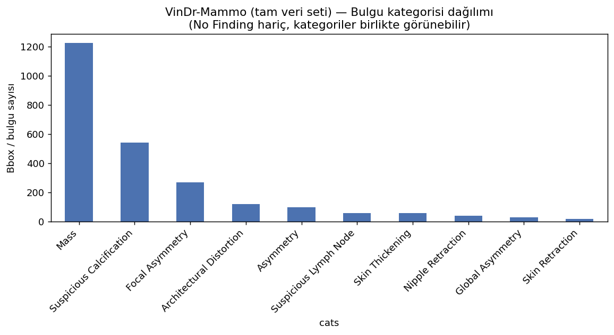
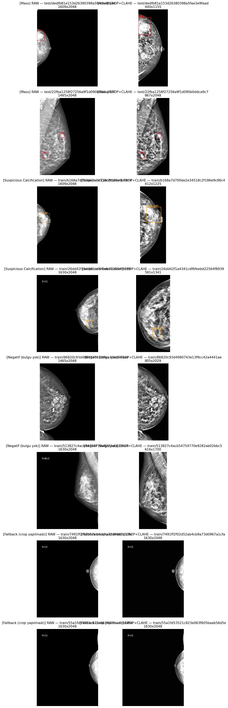
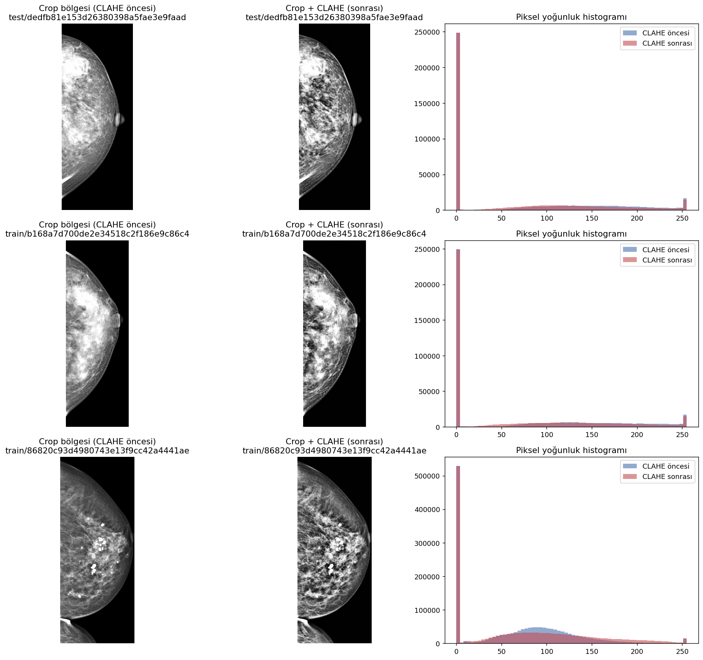
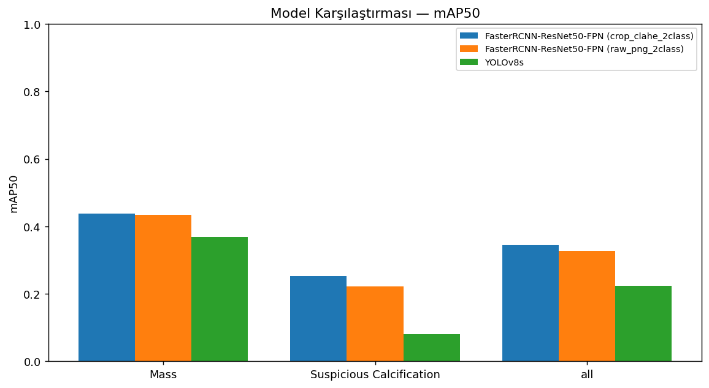
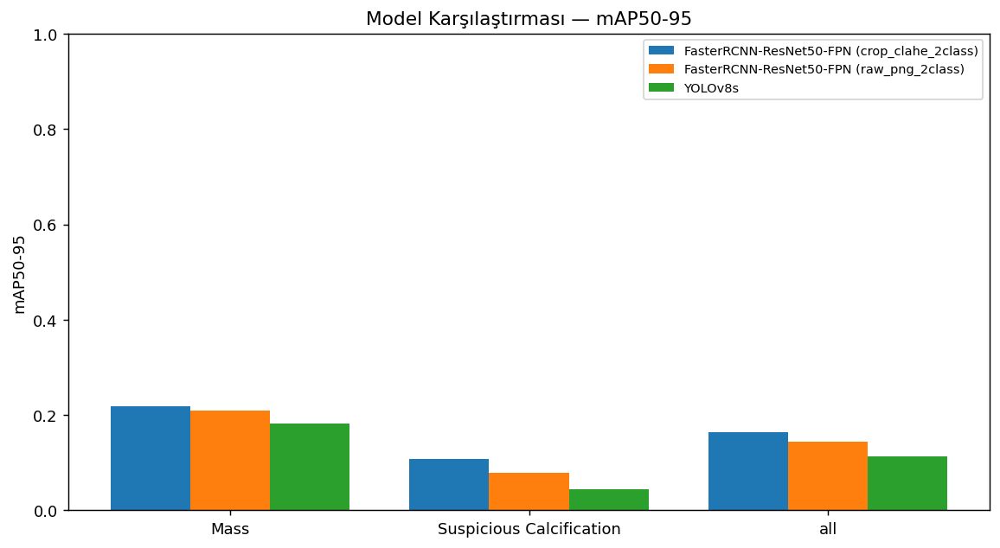
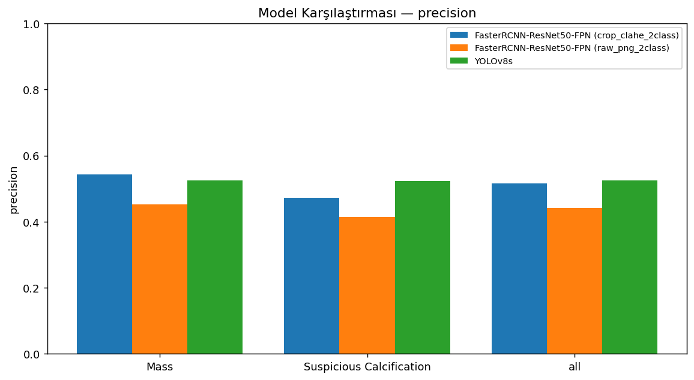
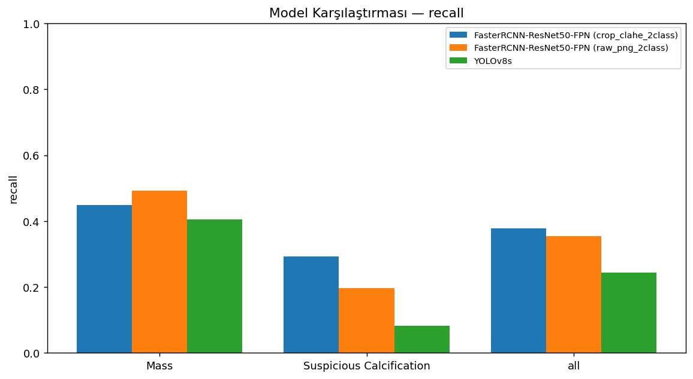
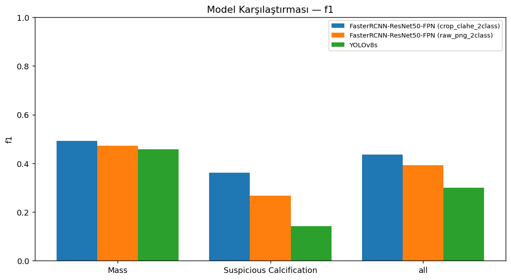
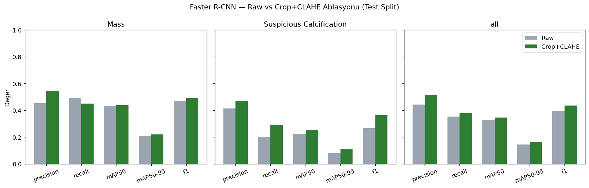
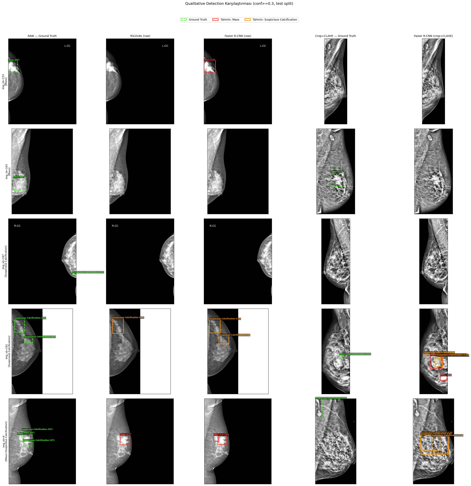

# VinDr-Mammo — Mass & Suspicious Calcification Tespiti (2 Sınıf)

Bu projede, [VinDr-Mammo](https://physionet.org/content/vindr-mammo/1.0.0/) veri
setinden seçilen **2 sınıflı (Mass, Suspicious Calcification)** bir alt küme
üzerinde mamografi lezyon tespiti (object detection) yapılmıştır. Amaç, bir
tek-aşamalı (YOLOv8) ve bir iki-aşamalı (Faster R-CNN) dedektörü aynı veri ve
aynı değerlendirme protokolüyle karşılaştırmak, ardından literatürde
(Abdikenov et al. 2025) önerilen **crop + CLAHE ön işleme** adımının Faster
R-CNN üzerindeki etkisini bir ablasyon deneyiyle ölçmektir.

Tüm modeller COCO-pretrained ağırlıklardan fine-tune edilmiş, aynı
study-level train/val/test split (seed=42) kullanılmıştır — sızıntı (data
leakage) yoktur.

## İçindekiler

1. [Veri Seti](#1-veri-seti)
2. [Uçtan Uca İşlem Hattı (Pipeline)](#2-uçtan-uca-işlem-hattı-pipeline)
3. [Modeller ve Metodoloji](#3-modeller-ve-metodoloji)
4. [Kurulum ve Çalıştırma](#4-kurulum-ve-çalıştırma-google-colab)
5. [Sonuçlar](#5-sonuçlar-test-split)
6. [Qualitative Sonuçlar](#6-qualitative-sonuçlar-gt-vs-tahmin)
7. [Repo Yapısı](#7-repo-yapısı)
8. [Lisans](#8-lisans)
9. [Referanslar](#9-referanslar)
10. [Sınırlamalar ve Sonraki Adımlar](#10-sınırlamalar-ve-sonraki-adımlar)

---

## 1. Veri Seti

### 1.1 Kaynak veri seti: VinDr-Mammo

[VinDr-Mammo](https://physionet.org/content/vindr-mammo/1.0.0/), Vietnam'da
toplanan, **5000 çalışma (study)** ve her çalışma için 4 standart görüntüden
(L-CC, L-MLO, R-CC, R-MLO) oluşan toplam **20.000 full-field dijital mamografi
(FFDM) DICOM görüntüsü** içeren, BI-RADS ve meme yoğunluğu (breast density)
etiketleriyle birlikte bulgu-seviyesi (finding-level) bounding box
annotasyonları sunan büyük ölçekli bir açık veri setidir (Nguyen et al. 2023,
*Scientific Data* — bkz. [Referanslar](#8-referanslar)).

**Veriye erişim:** Veri seti [PhysioNet](https://physionet.org/content/vindr-mammo/1.0.0/)
üzerinde barındırılıyor ve **credentialed access** gerektiriyor: PhysioNet
hesabı açılması, veri setine özel **Data Use Agreement (DUA)**'ın
imzalanması gerekiyor. Bu nedenle ham DICOM görüntüleri **bu repoda yer
almıyor** — sadece annotasyon CSV'leri, bizim ürettiğimiz türetilmiş veri
(PNG / crop+CLAHE etiketleri, istatistikler) ve eğitim/değerlendirme
çıktıları (figürler, metrikler, ağırlık dosyaları hariç) paylaşılıyor.

DUA onaylandıktan sonra PhysioNet, veri setinin kök dizininde şu dosyaları
sunuyor (üçü de bu repoda mevcut, kod referansı ve EDA için):

| Dosya | Satır | İçerik |
|---|---|---|
| [`breast-level_annotations.csv`](breast-level_annotations.csv) | 20.000 | `study_id, series_id, image_id, laterality, view_position, height, width, breast_birads, breast_density, split` |
| [`finding_annotations.csv`](finding_annotations.csv) | 20.486 | yukarıdakine ek olarak `finding_categories` (liste), `finding_birads`, `xmin, ymin, xmax, ymax` (bbox) |
| [`metadata.csv`](metadata.csv) | 20.000 | DICOM header alanları (`Patient's Age`, `Manufacturer`, `Pixel Spacing`, vb., 21 kolon) |

Veri setinin resmi görselleştirme/EDA scripti:
[vinbigdata-medical/vindr-mammo](https://github.com/vinbigdata-medical/vindr-mammo)
(bounding box overlay örnekleri için kullanıldı, referans olarak).

### 1.2 Tam veri seti — özet EDA

Çalışmaya başlamadan önce, hedef sınıfları seçmek için tüm 20.000 görüntülük
veri setinin annotasyon dağılımına bakıldı
(`dataset/eda_full_dataset/`):

**BI-RADS dağılımı** (breast-level):

| BI-RADS | 1 | 2 | 3 | 4 | 5 |
|---|---|---|---|---|---|
| Adet | 13.406 | 4.676 | 930 | 762 | 226 |

**Yoğunluk (breast density) dağılımı:**

| Density | A | B | C | D |
|---|---|---|---|---|
| Adet | 100 | 1.908 | 15.292 | 2.700 |

**Resmi split:**
training = 16.000, test = 4.000. *(Not: bu, PhysioNet'in kendi train/test
ayrımıdır — bizim alt kümemiz için kullandığımız study-level
train/val/test (seed=42) split'inden farklıdır, bkz. §1.3.)*

**Bulgu kategorisi (finding_categories) dağılımı** —
`finding_annotations.csv`'deki 20.486 bulgu satırı, "No Finding" hariç
(bir görüntüde birden fazla bulgu kategorisi birlikte bulunabilir):



| Kategori | Adet |
|---|---|
| No Finding | 18.232 |
| **Mass** | **1.226** |
| **Suspicious Calcification** | **543** |
| Focal Asymmetry | 269 |
| Architectural Distortion | 119 |
| Asymmetry | 97 |
| Suspicious Lymph Node | 57 |
| Skin Thickening | 57 |
| Nipple Retraction | 37 |
| Global Asymmetry | 26 |
| Skin Retraction | 18 |

**Neden Mass + Suspicious Calcification?** Gerçekleştirilen EDA sonucunda Mass ve Suspicious Calcification, VinDr-Mammo veri setinde No Finding dışındaki en fazla anotasyona sahip iki bulgu kategorisi olarak belirlenmiştir. Bu durum, daha az örnek içeren sınıflara kıyasla model eğitimi ve sınıf bazlı değerlendirme için daha yeterli bir örneklem sağlamaktadır. Ayrıca iki sınıf farklı tespit zorluklarını temsil etmektedir: kitleler daha geniş ve bölgesel yapılar oluştururken, şüpheli kalsifikasyonlar çoğunlukla küçük ve ince ayrıntılar biçiminde görülür. Bu nedenle bu iki sınıfın birlikte kullanılması, nesne tespit modellerinin farklı boyut ve görsel özelliklere sahip mamografik bulgular üzerindeki performansını karşılaştırmaya imkân vermektedir.

### 1.3 Çalışma alt kümesi: `target2class_subset_v2_medium_balanced`

20.000 görüntülük tam veri setinin DICOM'larını indirip işlemek hem zaman hem
depolama açısından bu proje kapsamında mümkün olmamıştır, bu nedenle hedeflenen 2 sınıfı
(Mass, Suspicious Calcification) içeren çalışmalar + zor negatifler (başka
bulgu içeren ama hedef sınıf olmayan) + normal negatifler (No Finding) içeren
dengeli bir alt küme seçildi:

- **510 çalışma (study), 2040 görüntü**
- Study-level (hasta-bazlı sızıntı önleyen) train/val/test split:
  **0.70 / 0.15 / 0.15, seed=42**
- Seçim ve indirme süreci detayları:
  [`DATASET_SELECTION_REPORT.md`](dataset/subsets/target2class_subset_v2_medium_balanced/subset_audit/reports/target2class_subset_v2_medium_balanced_DATASET_SELECTION_REPORT.md),
  [`FINAL_DOWNLOAD_REPORT.md`](dataset/subsets/target2class_subset_v2_medium_balanced/subset_audit/reports/target2class_subset_v2_medium_balanced_FINAL_DOWNLOAD_REPORT.md)

**Etiketleme kuralı:** Aynı kutu hem Mass hem Suspicious Calcification
içeriyorsa birincil etiket Mass olacak şekilde düzenlenmiştir (`class_mapping.json`).

| Split | Görüntü | Pozitif | Negatif | Mass kutusu | Susp. Calc. kutusu |
|---|---|---|---|---|---|
| train | 1418 | 486 | 932 | 346 | 318 |
| val   | 306  | 103 | 203 | 77  | 54  |
| test  | 308  | 95  | 213 | 69  | 61  |

(Kaynak: `dataset/prepared_datasets/target2class_subset_v2_medium_balanced/tables/eda_split_summary.csv`,
PNG dönüşümü ve EDA detayları:
[`PNG_PREPARATION_AND_EDA_REPORT.md`](dataset/subsets/target2class_subset_v2_medium_balanced/prepared_dataset_reports/target2class_subset_v2_medium_balanced_PNG_PREPARATION_AND_EDA_REPORT.md))

---

## 2. Uçtan Uca İşlem Hattı (Pipeline)

Pipeline 4 ana adımdan oluşuyor; her adımın çıktısı bir sonrakinin girdisi.
Tüm adımlar Google Colab'da, `vindr_mammo`
proje klasörü üzerinde çalıştırıldı (bkz. [§4](#4-kurulum-ve-çalıştırma-google-colab)).

```
PhysioNet (DUA)          Alt küme seçimi        DICOM → PNG          Crop + CLAHE        COCO / YOLO
   DICOM'ları    ─────▶   + indirme      ─────▶  + 2-sınıf    ─────▶  ön işleme   ─────▶  format üretimi  ─────▶ Eğitim
  (20.000 img)            (2040 img)             etiketleme           (varyant 2)          (varyant 1 & 2)
```

### 2.1 Adım 1 — Alt küme seçimi ve DICOM indirme

Notebook: [`vindr_mammo_2class_subset_download_2.ipynb`](vindr_mammo_2class_subset_download_2%20%281%29.ipynb)

- `breast-level_annotations.csv` + `finding_annotations.csv` üzerinden, en az
  bir hedef bulgu (Mass veya Suspicious Calcification) içeren çalışmalar,
  zor negatifler ve normal negatifler seçildi → `subset_manifest.csv`
  (510 çalışma, 2040 görüntü) ve `selected_dicom_urls.txt` üretildi.
- Study-level train/val/test split (0.70/0.15/0.15, seed=42) uygulandı,
  sınıf/density/BI-RADS dağılımlarının split'ler arasında dengeli olduğu
  doğrulandı (`subset_audit/tables/`, `subset_audit/figures/`).
- Seçilen DICOM dosyaları PhysioNet'ten (DUA kimlik bilgileriyle `wget`)
  indirildi; indirme durumu ve eksik dosya kontrolü
  `subset_audit/tables/dicom_download_status_*.csv` içinde raporlandı.
- Çıktı raporları: `DATASET_SELECTION_REPORT.md`, `FINAL_DOWNLOAD_REPORT.md`.

### 2.2 Adım 2 — DICOM → PNG dönüşümü ve 2-sınıf etiketleme

- Her DICOM görüntüsünün piksel verisi (`pydicom`) okunup, VOI LUT /
  windowing uygulanarak 8-bit gri tonlamalı **PNG**'ye dönüştürüldü
  (`dataset/prepared_datasets/target2class_subset_v2_medium_balanced/`,
  varyant adı: **`raw_png_2class`**).
- `finding_annotations.csv`'deki `xmin, ymin, xmax, ymax` bbox'ları, sadece
  Mass ve Suspicious Calcification kategorileri tutularak, hem **YOLO-txt**
  (`labels/<split>/*.txt`, normalize `class xc yc w h`) hem de **COCO JSON**
  (`annotations/instances_{train,val,test}.json`, piksel `bbox=[x,y,w,h]`,
  `category_id`: 1=Mass, 2=Suspicious Calcification) formatına çevrildi.
- Aynı kutu her iki kategoriyi de içeriyorsa, birincil etiket **Mass** olarak
  belirlendi (`class_mapping.json` → `same_box_multilabel_rule`).
- Split bazlı görüntü/kutu sayıları, BI-RADS/density dağılımları EDA olarak
  raporlandı: [`PNG_PREPARATION_AND_EDA_REPORT.md`](dataset/subsets/target2class_subset_v2_medium_balanced/prepared_dataset_reports/target2class_subset_v2_medium_balanced_PNG_PREPARATION_AND_EDA_REPORT.md)

### 2.3 Adım 3 — Crop + CLAHE ön işleme (2. veri seti varyantı)

Abdikenov et al. (2025)'in önerdiği ön işleme adımına dayanarak, `raw_png_2class`'tan
ikinci bir varyant (**`crop_clahe_2class`**) üretildi:

1. **Otsu eşikleme + kontur tabanlı meme bölgesi crop'u** — görüntüdeki siyah
   arka plan/etiket alanları kırpılıp sadece meme dokusu bırakıldı (kenarlara
   %3.5 margin eklendi). Bounding box koordinatları crop'a göre yeniden
   hesaplandı.
2. **CLAHE** (`clipLimit=2.0`, `tileGridSize=(8,8)`) ile kontrast
   iyileştirmesi uygulandı — özellikle küçük/düşük kontrastlı
   kalsifikasyonların görünürlüğünü artırmak amacıyla.

Algoritma detayları ve önce/sonra istatistikleri:
[`CROP_CLAHE_PREPROCESSING_REPORT.md`](dataset/subsets/target2class_subset_v2_medium_balanced/prepared_dataset_reports/target2class_subset_v2_medium_balanced_CROP_CLAHE_PREPROCESSING_REPORT.md)

**Örnek (before/after, bbox overlay):**



**CLAHE öncesi/sonrası piksel histogramı:**



### 2.4 Adım 4 — COCO / YOLO formatlarının kullanımı

Her iki veri seti varyantı (`raw_png_2class`, `crop_clahe_2class`) için aynı
iki etiket formatı üretildi; hangi modelin hangi formatı kullandığı §3'te
açıklanıyor:

- **YOLO-txt + `data.yaml`** → YOLOv8 (Ultralytics'in doğal formatı).
- **COCO JSON** (`annotations/instances_{train,val,test}.json`) → Faster
  R-CNN (torchvision'ın doğal formatı, `pycocotools`).

---

## 3. Modeller ve Metodoloji

| Model | Veri varyantı | Girdi boyutu | Pretrained | Metodoloji notu |
|---|---|---|---|---|
| YOLOv8s | raw_png_2class | 640×640 | COCO (`yolov8s.pt`) | [YOLOV8_BASELINE_METHODOLOGY.md](docs/YOLOV8_BASELINE_METHODOLOGY.md) |
| Faster R-CNN ResNet50-FPN | raw_png_2class | ~800px (orijinal en/boy oranı korunur) | COCO (`fasterrcnn_resnet50_fpn`) | [FASTERRCNN_BASELINE_METHODOLOGY.md](docs/FASTERRCNN_BASELINE_METHODOLOGY.md) |
| Faster R-CNN ResNet50-FPN (ablasyon) | crop_clahe_2class | ~800px | COCO | aynı metodoloji, sadece veri seti değişti (`scripts/train_fasterrcnn_crop_clahe.py`) |

Tüm modeller için ortak kurallar: seed=42, yatay flip (p=0.5) augmentasyonu,
final metrikler **hiç görülmemiş test kümesi** (308 görüntü) üzerinde
hesaplandı, çıktılar `runs/<model>/{train/, test_eval/, test_metrics.csv,
summary.json}` altında toplandı.

**Model seçim gerekçeleri**

- **YOLOv8s** — görev tanımının izin verdiği YOLO ailesinden, Ultralytics ile
  Colab'da hızlı kurulum/eğitim; Karaca Aydemir et al. (2025) ve Abdikenov et
  al. (2025) ile doğrudan literatür karşılaştırma noktaları mevcut. Detaylar:
  [YOLOV8_BASELINE_METHODOLOGY.md](docs/YOLOV8_BASELINE_METHODOLOGY.md).
- **Faster R-CNN (ResNet50-FPN)** — görev tanımının istediği two-stage
  alternatif; Ribli et al. (2018) ile aynı aile, FPN ile çok ölçekli
  özellik çıkarımı (büyük kitleler vs. küçük kalsifikasyonlar). Detaylar:
  [FASTERRCNN_BASELINE_METHODOLOGY.md](docs/FASTERRCNN_BASELINE_METHODOLOGY.md).
- **Crop+CLAHE ablasyonu** — Abdikenov et al. (2025)'in raw → crop+CLAHE ile
  genel mAP50'yi 0.438 → 0.590'a çıkardığını raporlamasından yola çıkarak,
  aynı iyileşmenin bizim veri setimizde de (özellikle Suspicious
  Calcification sınıfında) gözlenip gözlenmediği test edildi.

**Önemli kısıtlama:** YOLOv8 P/R/F1 değerleri Ultralytics'in PR eğrisindeki "en
iyi F1" noktasında (dinamik eşik) raporlanırken, Faster R-CNN için sabit
`confidence≥0.5, IoU≥0.5` eşiği kullanıldı. Bu nedenle **modeller arası asıl
karşılaştırma mAP50 / mAP50-95 üzerinden yapılmalıdır** — bu iki metrik her iki
model için de aynı COCO-style IoU eşleştirme mantığıyla hesaplanıyor.

---

## 4. Kurulum ve Çalıştırma (Google Colab)

Tüm `scripts/*.py` dosyaları Google Colab'da (GPU runtime, T4) çalıştırılmak
üzere yazıldı. Beklenen klasör yapısı, Drive'a mount edilmiş bir
`vindr_mammo/` proje klasörü altında bu repodaki `dataset/`, `runs/`,
`scripts/` klasörlerinin aynısıdır.

**Gereksinimler** (Colab'da genelde hazır gelir, eksikse [`requirements.txt`](requirements.txt)):

```bash
pip install -r requirements.txt
```

**Çalıştırma sırası:**

0. [`vindr_mammo_2class_subset_download_2.ipynb`](vindr_mammo_2class_subset_download_2%20%281%29.ipynb)
   → PhysioNet'ten alt küme DICOM'larını indirir, `subset_manifest.csv` ve
   split tablolarını üretir. *(PhysioNet DUA kimlik bilgisi gerektirir.)*
1. `train_yolov8_raw_baseline.py` → `runs/yolov8s_raw_baseline/`
2. `train_fasterrcnn_raw_baseline.py` → `runs/fasterrcnn_raw_baseline/`
3. `evaluate_fasterrcnn.py` → Faster R-CNN confusion matrix + PR eğrisi
4. `train_fasterrcnn_crop_clahe.py` → `runs/fasterrcnn_crop_clahe/` (ablasyon)
5. `visualize_crop_clahe_before_after.py` → ön işleme görselleştirmeleri
6. `compare_models.py` → 3-yönlü karşılaştırma + ablasyon grafikleri (yerel, `runs/*/test_metrics.csv` üzerinden)
7. `visualize_qualitative_detections.py` → GT vs tahmin bbox overlay

DICOM → PNG dönüşümü ve crop+CLAHE üretimi adım 0 ile adım 1 arasında, alt
küme indirildikten sonra ayrı bir hazırlık scriptiyle yapılır (çıktıları
`dataset/prepared_datasets/` altında zaten bu repoda mevcut).

---

## 5. Sonuçlar (Test Split)

Kaynak: [`runs/comparison/all_models_test_metrics.csv`](runs/comparison/all_models_test_metrics.csv)
(`scripts/compare_models.py` ile üretildi).

### 5.1 Genel (tüm sınıflar)

| Model | Veri varyantı | Precision | Recall | mAP50 | mAP50-95 | F1 |
|---|---|---|---|---|---|---|
| YOLOv8s | raw | 0.524 | 0.244 | 0.225 | 0.113 | 0.300 |
| Faster R-CNN ResNet50-FPN | raw | 0.442 | 0.354 | 0.328 | 0.144 | 0.393 |
| Faster R-CNN ResNet50-FPN | crop+CLAHE | 0.516 | 0.378 | **0.346** | **0.163** | **0.436** |

### 5.2 Sınıf bazlı

| Model (varyant) | Sınıf | Precision | Recall | mAP50 | mAP50-95 | F1 |
|---|---|---|---|---|---|---|
| YOLOv8s (raw) | Mass | 0.526 | 0.406 | 0.368 | 0.183 | 0.458 |
| YOLOv8s (raw) | Susp. Calc. | 0.523 | 0.082 | 0.081 | 0.044 | 0.142 |
| Faster R-CNN (raw) | Mass | 0.453 | 0.493 | 0.434 | 0.209 | 0.472 |
| Faster R-CNN (raw) | Susp. Calc. | 0.414 | 0.197 | 0.221 | 0.079 | 0.267 |
| Faster R-CNN (crop+CLAHE) | Mass | 0.544 | 0.449 | 0.438 | 0.219 | 0.492 |
| Faster R-CNN (crop+CLAHE) | Susp. Calc. | 0.472 | 0.293 | 0.253 | 0.108 | 0.362 |

### 5.3 Karşılaştırma Grafikleri

| mAP50 | mAP50-95 |
|---|---|
|  |  |

| Precision | Recall | F1 |
|---|---|---|
|  |  |  |

### 5.4 Ablasyon: Faster R-CNN — Raw vs Crop+CLAHE



Crop+CLAHE, genel mAP50'yi **0.328 → 0.346** ve genel F1'i **0.393 → 0.436**
artırıyor; iyileşmenin büyük kısmı **Suspicious Calcification** sınıfında
(mAP50 0.221 → 0.253, F1 0.267 → 0.362) — literatürdeki (Abdikenov et al. 2025)
beklentiyle tutarlı: crop+CLAHE'nin asıl faydası küçük/düşük kontrastlı
bulgularda görülüyor.

### 5.5 Eğitim Eğrileri ve Diğer Değerlendirme Grafikleri

Her model için ayrıntılı eğitim eğrileri, confusion matrix ve PR eğrisi
ilgili `runs/<model>/train/` ve `runs/<model>/test_eval/` klasörlerinde, ve
yorumları [`docs/YOLOV8_RAW_BASELINE_RESULTS.md`](docs/YOLOV8_RAW_BASELINE_RESULTS.md)
içinde bulunur.

---

## 6. Qualitative Sonuçlar (GT vs Tahmin)

Test split'ten seçilen 5 örnek üzerinde gerçek (GT, yeşil kesikli) kutular ile
3 modelin tahminlerinin (kırmızı=Mass, turuncu=Suspicious Calcification,
confidence skorlu) karşılaştırması:



Üretim scripti: `scripts/visualize_qualitative_detections.py` (Colab).

---

## 7. Repo Yapısı

```
.
├── README.md
├── LICENSE                         # kod için MIT lisansı
├── DATA_LICENSE.txt                # VinDr-Mammo veri seti için PhysioNet Restricted Health Data License
├── requirements.txt
├── .gitignore
├── breast-level_annotations.csv   # VinDr-Mammo orijinal annotasyon (20.000 satır)
├── finding_annotations.csv        # VinDr-Mammo orijinal bulgu annotasyonu (20.486 satır)
├── metadata.csv                   # VinDr-Mammo DICOM metadata (20.000 satır)
├── vindr_mammo_2class_subset_download_2 (1).ipynb   # Adım 0: alt küme seçimi + DICOM indirme
├── dataset/
│   ├── eda_full_dataset/
│   │   └── figures/finding_category_distribution.png   # tam veri seti EDA grafiği
│   ├── subsets/.../subset_audit/        # alt küme seçimi, indirme raporları
│   ├── subsets/.../prepared_dataset_reports/   # PNG dönüşümü + crop/CLAHE raporları
│   └── prepared_datasets/
│       ├── target2class_subset_v2_medium_balanced/             # raw_png_2class (annotations, EDA tabloları)
│       └── target2class_subset_v2_medium_balanced_crop_clahe_2class/  # crop+CLAHE (annotations, EDA, figürler)
├── docs/
│   ├── YOLOV8_BASELINE_METHODOLOGY.md
│   ├── YOLOV8_RAW_BASELINE_RESULTS.md
│   └── FASTERRCNN_BASELINE_METHODOLOGY.md
├── runs/
│   ├── yolov8s_raw_baseline/            # train/, test_eval/, test_metrics.csv, summary.json
│   ├── fasterrcnn_raw_baseline/
│   ├── fasterrcnn_crop_clahe/
│   └── comparison/                      # compare_models.py + qualitative çıktıları
└── scripts/
    ├── train_yolov8_raw_baseline.py
    ├── train_fasterrcnn_raw_baseline.py
    ├── train_fasterrcnn_crop_clahe.py
    ├── evaluate_fasterrcnn.py
    ├── visualize_crop_clahe_before_after.py
    ├── visualize_qualitative_detections.py
    └── compare_models.py
```

*Not: Ham DICOM görüntüleri ve büyük PNG klasörleri (PhysioNet DUA nedeniyle),
model ağırlık dosyaları (`*.pt`, 20-160MB) ve referans makale PDF'leri
(telif hakkı) `.gitignore` ile bu repodan hariç tutulmuştur — bkz.
[`.gitignore`](.gitignore).*

---

## 8. Lisans

- **Kod** (`scripts/`, notebook, dokümantasyon): [MIT License](LICENSE).
- **Veri seti** (VinDr-Mammo ve ondan türetilen annotasyonlar):
  [PhysioNet Restricted Health Data License v1.5.0](DATA_LICENSE.txt) —
  PhysioNet Data Use Agreement koşullarına tabidir, ham görüntüler bu
  repoda yer almaz (bkz. [§1.1](#11-kaynak-veri-seti-vindr-mammo)).

---

## 9. Referanslar

- Nguyen, H.T., Nguyen, H.Q., Pham, H.H. et al. (2023). **VinDr-Mammo: A
  large-scale benchmark dataset for computer-aided diagnosis in full-field
  digital mammography.** *Scientific Data*, 10, 277.
  [doi:10.1038/s41597-023-02100-7](https://doi.org/10.1038/s41597-023-02100-7)
  — kullanılan veri setinin kaynak yayını.
- Ribli, D., Horváth, A., Unger, Z., Pollner, P., Csabai, I. (2018).
  **Detecting and classifying lesions in mammograms with Deep Learning.**
  *Scientific Reports*, 8, 4165.
  [doi:10.1038/s41598-018-22437-z](https://doi.org/10.1038/s41598-018-22437-z)
  — Faster R-CNN tabanlı mamografi lezyon tespiti, model seçimine referans.
- Karaca Aydemir, B.K. et al. (2025). **Detecting and classifying breast
  masses via YOLO-based deep learning.** *Neural Computing and Applications.*
  [doi:10.1007/s00521-025-11153-1](https://doi.org/10.1007/s00521-025-11153-1)
  — YOLO varyant seçimi ve hiperparametre karşılaştırmaları için referans.
- Abdikenov, B., Rakishev, D., Orazayev, Y., Zhaksylyk, T. (2025).
  **Enhancing Breast Lesion Detection in Mammograms via Transfer Learning.**
  *Journal of Imaging*, 11(9), 314.
  [doi:10.3390/jimaging11090314](https://doi.org/10.3390/jimaging11090314)
  — crop+CLAHE ön işleme ablasyonu ve hiperparametre/eğitim protokolü için
  ana referans.
- Cao, Z., Duan, L., Yang, G., Yue, T., Chen, Q. (2019). **An experimental
  study on breast lesion detection and classification from ultrasound images
  using deep learning architectures.** *BMC Medical Imaging*, 19, 51.
  [doi:10.1186/s12880-019-0349-x](https://doi.org/10.1186/s12880-019-0349-x)
  — derin öğrenme tabanlı meme lezyon tespiti literatür taraması için
  incelendi.
- [vinbigdata-medical/vindr-mammo](https://github.com/vinbigdata-medical/vindr-mammo)
  — VinDr-Mammo resmi görselleştirme/EDA scriptleri.
- [delmalih/mias-mammography-obj-detection](https://github.com/delmalih/mias-mammography-obj-detection)
  — repo yapısı için ilham alınan benzer bir mamografi nesne tespiti projesi.

---

## 10. Sınırlamalar ve Sonraki Adımlar

- Veri seti boyutu (1418 train görüntüsü), literatürdeki tam VinDr-Mammo
  çalışmalarına (binlerce görüntü) göre küçük; mutlak mAP değerleri bu
  nedenle daha düşük çıkıyor — ancak göreli karşılaştırmalar (model vs.
  model, raw vs. crop+CLAHE) ve literatürle örüntü uyumu anlamlı.
- YOLOv8 (640px) ve Faster R-CNN (~800px) farklı girdi çözünürlükleriyle
  çalışıyor — her model kendi standart pratiğiyle değerlendirildi, tam
  "apples-to-apples" değil.
- RetinaNet karşılaştırması kapsam dışı bırakıldı (zaman kısıtı).
- Crop+CLAHE ablasyonu sadece Faster R-CNN üzerinde yapıldı; YOLOv8 +
  crop+CLAHE kombinasyonu gelecek bir deney olarak not edildi.
- Suspicious Calcification sınıfı tüm modellerde Mass'a göre daha düşük
  performans gösteriyor (literatürle tutarlı, küçük/düşük kontrastlı
  nesnelerin tespiti zor) — yüksek çözünürlüklü patch/tile tabanlı bir
  yaklaşım gelecekte denenebilir.
