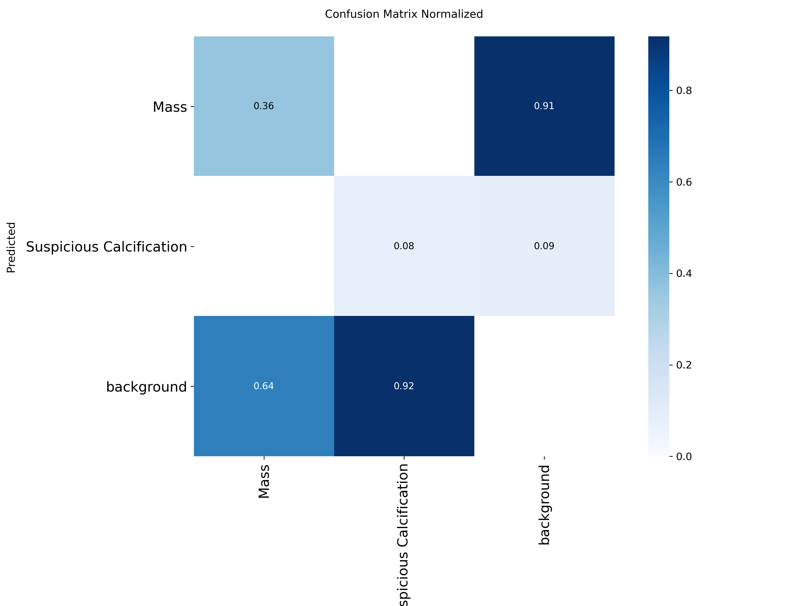
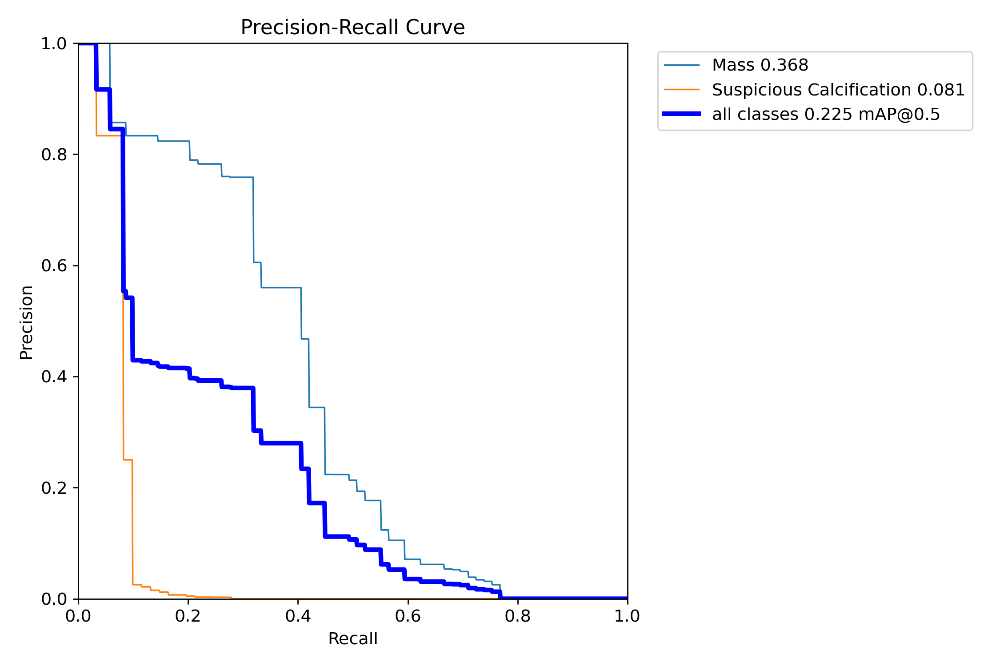
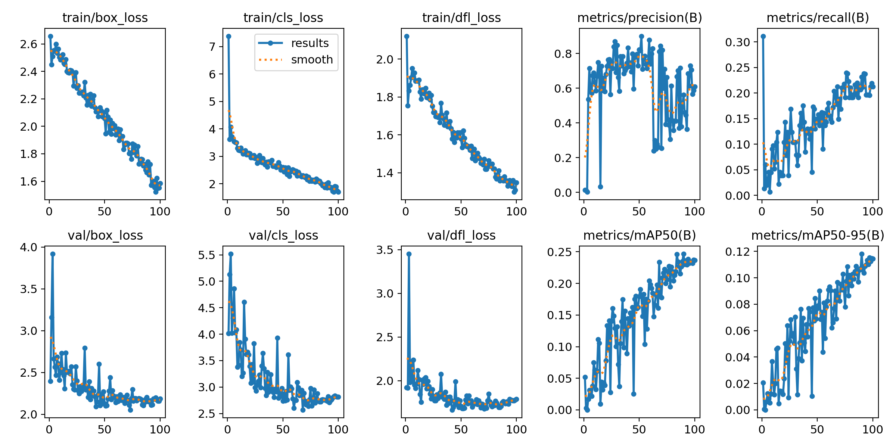

# YOLOv8s — Raw PNG 2-Class Baseline: Sonuçlar

Bu doküman `scripts/train_yolov8_raw_baseline.py` ile elde edilen sonuçları
(`runs/yolov8s_raw_baseline/`) yorumlar. Hiperparametre gerekçeleri için
`docs/YOLOV8_BASELINE_METHODOLOGY.md`'ye bakınız.

## 1. Test split metrikleri

Kaynak: `runs/yolov8s_raw_baseline/test_metrics.csv` (308 görüntü, hiç görülmemiş test split).

| Sınıf | Precision | Recall | mAP50 | mAP50-95 | F1 |
|---|---|---|---|---|---|
| Mass | 0.526 | 0.406 | 0.368 | 0.183 | 0.458 |
| Suspicious Calcification | 0.523 | 0.082 | 0.081 | 0.044 | 0.142 |
| **Tümü (all)** | **0.524** | **0.244** | **0.225** | **0.113** | **0.300** |

## 2. Ne anlama geliyor? (yorumlama)

### Mass (mAP50 = 0.368)

Model, kitle (mass) bulgularının ~%41'ini (recall=0.406) IoU≥0.5 ile doğru
buluyor; bulduklarının ~%53'ü (precision=0.526) doğru pozitif. Bu, "orta"
seviyede ama kullanılabilir bir baseline performansı.

**Literatürle karşılaştırma:** Abdikenov et al. (2025), VinDr-Mammo üzerinde
preprocessing'siz (raw) YOLO modelleri için mass mAP50 ≈ **0.438** raporluyor.
Bizim sonucumuz (0.368) biraz daha düşük ama aynı büyüklük mertebesinde. Fark
muhtemelen veri seti boyutuyla açıklanabilir: bizim `medium_balanced` alt
kümemiz **1424 train görüntüsü** içeriyor, Abdikenov'un kullandığı tam VinDr-Mammo
train seti çok daha büyük (binlerce görüntü). Daha az veriyle eğitilen bir
model için bu fark beklenen bir durum — hata değil, veri seti boyutu kısıtının
bir sonucu.

### Suspicious Calcification (mAP50 = 0.081)

Recall sadece **0.082** — model kalsifikasyonların büyük çoğunluğunu
(yaklaşık %92'sini) kaçırıyor. Precision (0.523) yüksek görünse de, bu çok az
sayıda doğru tahmine dayanıyor (toplam 58 GT kutusundan sadece ~5 doğru
tespit).

**Literatürle karşılaştırma:** Bu sonuç, literatürde defalarca raporlanan bir
örüntüyle **birebir uyumlu**: kombine/raw veri setlerinde calcification mAP50
genellikle **< 0.05–0.12** aralığında kalıyor (küçük boyut, düşük kontrast,
640px'e resize sırasında bilgi kaybı). Bizim sonucumuz (0.081) bu aralığın
içinde. Bu, **crop+CLAHE ön işlemenin asıl faydasının görüleceği yer** —
Abdikenov et al. crop+CLAHE ile genel mAP50'yi 0.438 → 0.590'a çıkarıyor ve
iyileşmenin büyük kısmı küçük/düşük kontrastlı bulgularda (calcification gibi)
ortaya çıkıyor.

### Genel (mAP50 = 0.225)

İki sınıfın ortalaması, Mass'ın taşıdığı ağırlık nedeniyle Calcification'a göre
daha yüksek. Bu sayı, crop+CLAHE veri setiyle aynı modeli yeniden eğittiğimizde
elde edeceğimiz iyileşmeyi ölçmek için **referans (baseline) değer** olarak
kullanılacak.

## 3. Confusion Matrix (normalize, test split)

- **Mass satır/sütun:** Gerçek Mass örneklerinin %36'sı doğru "Mass" olarak
  tahmin edilmiş, %64'ü "background" (kaçırılmış) olarak işaretlenmiş. Bu
  oran, recall=0.406 ile aynı büyüklükte (küçük fark, eşik/IoU hesaplama
  detaylarından kaynaklanıyor).
- **Suspicious Calcification satır/sütun:** Gerçek kalsifikasyonların sadece
  %8'i doğru tahmin edilmiş, %92'si kaçırılmış — recall=0.082 ile tutarlı.
- **background sütunu (yanlış pozitifler):** Modelin ürettiği yanlış
  pozitiflerin %91'i "Mass", %9'u "Suspicious Calcification" etiketli. Yani
  model, olmayan yerlerde de daha çok "Mass" görüyor — bu, Mass sınıfının
  daha "kolay/baskın" bir görsel desen olmasıyla tutarlı.

## 4. Precision-Recall Eğrisi (test split)

Mass eğrisi recall=0.4 civarına kadar yüksek precision (~0.6-0.8) koruyor,
sonra düşüyor — yani model "emin olduğu" Mass tahminlerinde oldukça güvenilir,
ama eşiği gevşetince (daha fazla tahmin yapınca) hata oranı hızla artıyor.
Calcification eğrisi ise çok dar bir recall aralığında (~0.08-0.28) kalıyor ve
precision hemen çöküyor — model bu sınıf için neredeyse hiç güvenilir
"yüksek-confidence" tahmin üretemiyor.

## 5. Eğitim Eğrileri (100 epoch, early stop tetiklenmedi)

- **train/box_loss, cls_loss, dfl_loss:** 100 epoch boyunca düzenli ve
  istikrarlı şekilde düşüyor — model öğreniyor, aşırı uyum (overfitting)
  belirtisi yok.
- **val/box_loss, cls_loss:** Genel eğilim düşüş yönünde ama gürültülü —
  küçük val seti (306 görüntü) ve mosaic/augmentasyon nedeniyle epoch'lar
  arası dalgalanma normal.
- **metrics/mAP50(B) (val):** Epoch 1-20 arası çok düşük ve gürültülü (model
  henüz "background" tahminine takılı), epoch ~20'den sonra istikrarlı şekilde
  artmaya başlıyor ve epoch 100'de ~0.236'ya ulaşıyor — test mAP50 (0.225) ile
  tutarlı, yani **model val ve test üzerinde benzer performans gösteriyor**
  (veri sızıntısı veya aşırı uyum yok).
- **patience=20 neden tetiklenmedi?** val mAP50 epoch 100'e kadar yavaş ama
  düzenli artmaya devam etti (her 20 epoch içinde en az bir kez yeni en iyi
  değere ulaşıldı). Bu, modelin 100 epoch'ta hâlâ "doymamış" olabileceğini
  gösteriyor — ancak crop+CLAHE veri setiyle yeniden eğitimde aynı 100
  epoch/patience=20 ayarını koruyarak adil bir karşılaştırma yapılacak.

## 6. Sonuç ve sıradaki adım

Raw baseline sonuçları literatürdeki beklentilerle (Mass mAP50≈0.37-0.44,
Calcification mAP50<0.12) tutarlı çıktı — yani pipeline (veri seti, eğitim
scripti, metrik hesaplama) doğru çalışıyor ve sonraki modellerle
karşılaştırma için sağlam bir referans noktası oluşturdu.

**Sıradaki adım:** Faster R-CNN (torchvision, ResNet50-FPN, COCO-pretrained)
ile aynı raw veri seti üzerinde baseline eğitim — aynı per-model klasör
yapısı (`runs/<model>/train/`, `test_eval/`, `test_metrics.csv`,
`summary.json`) ve aynı metrik formatı kullanılacak, böylece sonuçlar
doğrudan karşılaştırılabilir olacak.
